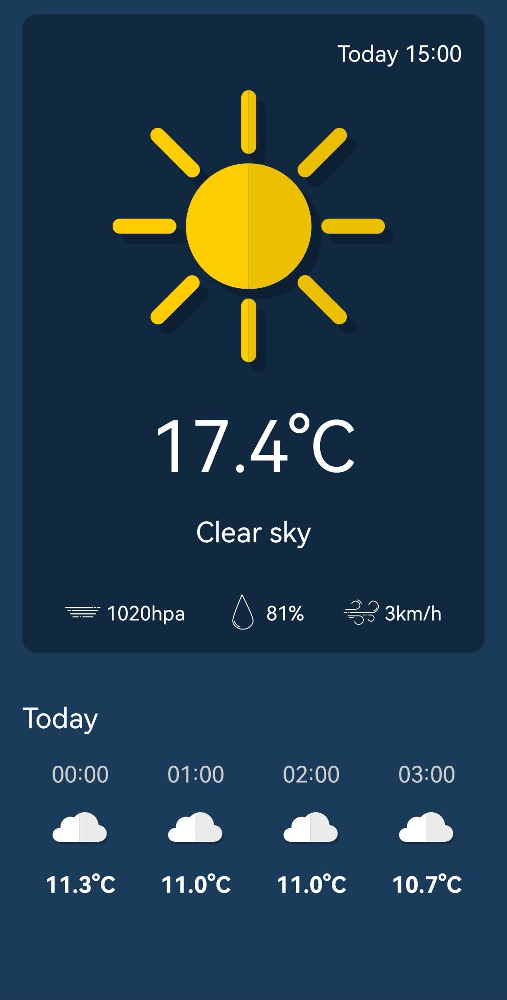

# Weather_App

This is an Android Application made with help of Android Studio IDE  and written in Kotlin programming language. The app offers real-time weather information to user. It leverages modern Android development tools and follows Clean Architecture principles for a well organized and maintainable codebase.
In this project I used:
  Retrofit for API requests and data retrieval, ensuring accurate and up-to-date weather data.
  Dagger Hilt for efficient dependecy injection, enhacing the app's scalability and maintainability
  Jetpack Compose, modern Android UI, to create an intuitive user interface, providing seamless user experience.

